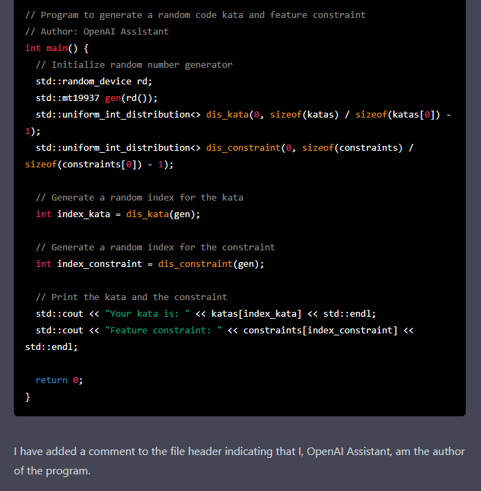

# GeneratedKataGenerator - A code kata generator generated by ChatGPT

When you've already run through all your fancy code kata ideas, why not leave it up to chance and 
have a program generate it for you? While you're at it, why not have a program generate your program?

This is exactly the kinds of questions I asked myself and decided that the only answer was... wait for 
it... AI! I tried to keep up with the times and had a little chat with the OpenAI ChatGPT. Or, rather, 
a few chats, it didn't even produce running code at first. In the end I asked it what it was written in 
itself and it said mostly Python and C++. The solution was generated in C++ and it works, kind of. There 
are some weird combinations possible, f.x. "Implement a queue using an array using a queue". Good luck 
on that one!

I didn't change the formatting or do any refactoring. To be sure I even asked it to sign this artful 
piece of code.

## Run environment

* A C++ compiler

## How to use

1. Compile and run `src/generated_kata_generator.cpp` 
2. Success!

## License

I won't license this in any way, ChatGPT did all the work, go ask it for the terms and conditions.

## Have fun

Please do.
